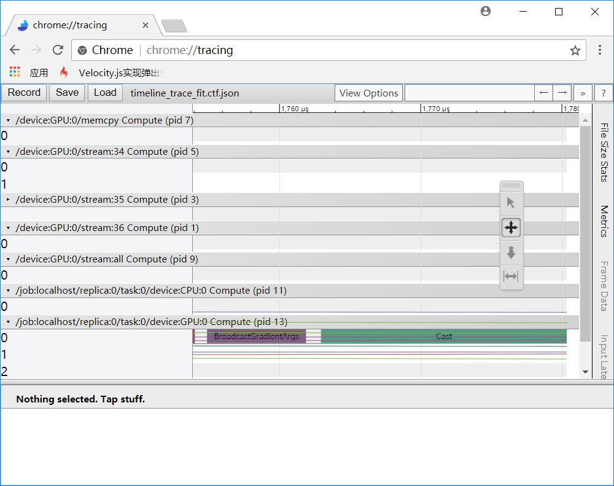

# 如何给keras模型生成timeline (profiling)

## Step 1

在编译模型之前，设置metadata信息：

```python
import tensorflow as tf
'''
...搭建模型...
'''
run_options = tf.RunOptions(trace_level=tf.RunOptions.FULL_TRACE)
run_metadata = tf.RunMetadata()
```

## Step 2

编译模型时，把`run_options`和`run_metadata`传入`model.compile`函数：

```python
model.compile(loss='binary_crossentropy', optimizer='adam', metrics=['accuracy'], options=run_options, run_metadata=run_metadata)
```

## Step 3

生成json格式的trace文件：

```python
trace_fit = timeline.Timeline(step_stats=run_metadata.step_stats)
trace = trace_fit.generate_chrome_trace_format()
with open('timeline_trace_fit.ctf.json', 'w') as f:
	f.write(trace)
```

## Step 4

在Chrome浏览器中，转到`chrome://tracing`，打开这个文件, 如下图所示。按Load按钮加载刚才生成的trace json文件。



注意这四个按钮：、、、：

### 按钮1: 选择一块区域

### 按钮2：拖动视野

### 按钮3：缩放视野

鼠标按住向上拖动：放大视野

鼠标按住向下拖动：缩小视野

### 按钮4：测量某一块的时间长度

